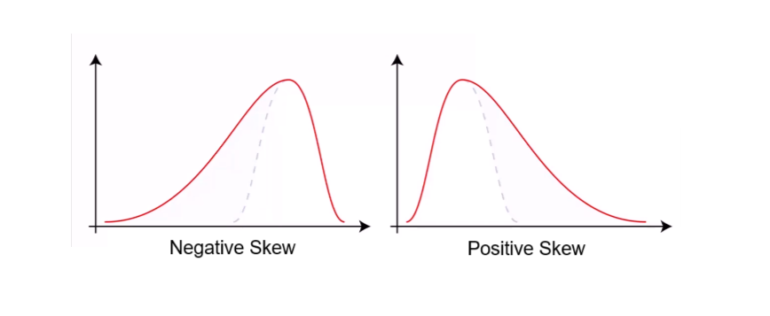

## Section 02: Statistics and Probability Refresher

#### Table of Contents

- Types of Data (Numerical, Categorical, Ordinal)
- Mean, Median, Mode
- Using mean, median, and mode in Python
- Variation and Standard Deviation
- Probability Density Function; Probability Mass Function
- Common Data Distributions (Normal, Binomial, Poisson, etc)
- Percentiles and Moments
- A Crash Course in matplotlib
- Advanced Visualization with Seaborn
- Covariance and Correlation
- Conditional Probability
- Exercise Solution: Conditional Probability of Purchase by Age
- Bayes' Theorem

### Types of Data (Numerical, Categorical, Ordinal)

#### Major Types of Data

- Numerical
- Categorical
- Ordinal

#### Numerical

- Represents some sort of quantitative measurement
  - Heights of people, page load times, stock prices, etc.
- Discrete Data
  - Integer based; often counts of some event.
    - How many purchases did a customer make in a year?
    - How many times did I flip "heads"?
- Continuous Data
  - Has an infinite number of possible values
    - How much time did it take for a user to check out?
    - How much rain fell on a given day?

#### Categorical Data

- Qualitative data that has no inherent mathematical meaning
  - Gender, Yes/No (binary data), Race, State of Residence, Produc Category,
    Political Party, etc.
- You can assign numbers to categories in order to represent them more
  compactly, but the numbers don't have mathematical meaning

#### Ordinal

- A mixture of numerical and categorical
- Categorical data that has mathematical meaning
- Example: movie ratings on a 1-5 scale.
  - Ratings must be 1, 2, 3, 4, or 5
  - But these values have mathematical meaning, 1 mean it's a worse movie than
    a 2.

#### Quiz Time!

Are the following types of data numerical, categorical or ordinal?

- How much gas is in your gas tank?
  - Numerical (continuous)
- A rating of your overall health where the choices are 1, 2, 3 or 4,
  corresponding to "poor", "moderate", "good" and "excellent".
  - Ordinal
- The races of your classmates
  - Categorical
- Ages in years
  - Numerical (discrete/continuous)
- Money spent in a store
  - Numerical (continuous)

### Mean, Median, Mode

#### Mean

- AKA average
- Sum / number of samples
- Example:
  - Number of children in each house on my street:

0, 2, 3, 2, 1, 0, 0, 2, 0

The MEAN is (0+2+3+2+1+0+0+2+0) / 9 = 1.11

#### Median

- Sort the values, and take the value at the midpoint 0, 2, 3, 2, 1, 0, 0, 2, 0

Sort it: 0, 0, 0, 0, 1, 2, 2, 2, 3

The MEDIAN is 1

- If you have an even number of samples, take the average of the two in the
  middle.
- Median is less susceptible to outliers than the mean
  - Example: mean household income in the US is $72,641, but the median is only
    $51,939. Because the mean is skewed by a handful of billionaires.
- Median better represents the "typical" American in this example.

#### Mode

- The most common value is a data set
  - Not relevant to continuous numerical data
- Back to our number of kids in each house example:

0, 2, 3, 2, 1, 0, 0, 2, 0

How many of each value are there?

0: 4, 1: 1, 2: 3, 3: 1

The MODE is 0

Refer to [mean.py](./code/mean.py) for coding exercises.

### Variation and Standard Deviation

#### Variance

Variance meansures how "spread-out" the data is.

- Variance is simply the **average of the squared differences from the mean**
- Example: What is the variance of the data set (1, 4, 5, 4, 8)?
  - First find the mean: (1 + 4 + 5 + 4 + 8) / 5 = 4.4
  - Now find the differences from the mean: (-3.4, -0.4, 0.6, -0.4, 3.6)
  - Find the squared differences: (11.56, 0.16, 0.36, 0.16, 12.96)
  - Find the average of the squared differences:
    - $\sigma^2$ = (11.56 + 0.16 + 0.36 + 0.16 + 12.96) / 5 = 5.04

#### Standard Deviation

Standard deviation is $\sigma$ is just the square root of the variance.
$$\sigma^2 = 5.04$$ $$\sigma = \sqrt{5.04} = 2.24$$

So the standard deviation of (1, 4, 5, 4, 8) is 2.24.

This is usually used as a way to identify outliers. Data points that lie more
than one standard deviation from the mean can be considered unusual.

You can talk about how extreme a data point is by talking about "how many
sigmas" away from the mean is.

#### Population vs. Sample

- If you are working with a sample of data instead of an entire data set (the
  entire population)...
  - Then you want to use the "sample variance" instead of the "population
    variance"
  - For N samples, you just divide the squared variances by N-1 instead of N.
  - So, in our example, we computed the population variance like this:
    - $\sigma^2 = (11.56 + 0.16 + 0.36 + 0.16 + 12.96) / 5 = 5.04$
  - But the sample variance would be:
    - $S^2 = (11.56 + 0.16 + 0.36 + 0.16 + 12.96) / 4 = 6.3$

#### Fancy Math

- Population vaiance: $$\sigma^2 = \frac{\sum (X-\mu)^2}{N}$$
- Sample variance $$S^2=\frac{\sum(X-M)^2}{N-1}$$

Refer to [variance.py](./code/variance.py) for coding exercises.

### Probability Distribution Functions

#### Normal Distribution

A normal distribution plot gives you the probability of a data point falling
within some given range of a given value.

The probability Density Function ("pdf") of a continuous random variable $X$
with support $S$ is an integral function $f(x)$ satisfying the following:

1. $f(x)$ is positive everywhere in the support $S$, that is, $f(x) >0$, for all
   $x$ in $S$
2. The area under the curve $f(x)$ in the support $S$ is 1, that is:
   $$\int_s f(x) dx = 1$$
3. If $f(x)$ is the p.d.f. of $x$, then the probability that $x$ belongs to $A$,
   where $A$ is some interval from a to b, is given by the integral of $f(x)$
   over that interval, that is:
   $$P(x\in A) = P[a \leq x \leq b] = \int^b_a f(x) dx.$$

#### Probability Mass Function

The probaility mass function is a function $P(X=x)$ that measures the
probability that a discrete random variable $X$ takes on a particular value $x$.
It is frequently denoted as $f(x)$. It satisfies the following:

- $P(X=x) = f(x) > 0, if $x \in $ the support $S$
- $\sum_{x\in S} f(x) = 1$
- $P(X \in A) = \sum_{x \in A} f(x)$

Refer to [distributions.py](./code/distributions.py) for coding exercises.

### Percentiles and Moments

#### Percentiles

- In a data set, what's the point at which X% of the values are less tahn that
  value?
- Example: income distribution
- Example: percentiles in a normal distribution

Refer to [percentiles.py](./code/percentiles.py) for coding exercises.

#### Moments

- Quantitative measures of the shape of a probability density function
- Mathematically they are a bit hard to wrap your head around:

  $\mu_n = \int^\infty_{-\infty} (x-c)^n f(x) dx$ (for moment $n$ around value
  $c$)

- But intuitively, it's a lot simpler in statistics.

#### The first moment is the mean

#### The second moment is the variance

#### The third moment is "skew" ($\gamma$)

- How "lopsided" is the distribution?
- A distribution with a longer tail on the left will be skewed left, and have a
  negative skew.

#### The fourth moment is "kurtosis"

- How thick the tail, and how sharp is the peak, compared to a normal
  distribution?
- Example: higher peaks have higher kurtosis

Refer to [percentiles.py](./code/percentiles.py) for coding exercises.

### A Crash Course in matplotlib

Refer to [matplotlib\_.py](./code/matplotlib_.py) for coding exercises.

### Advanced Visualization with Seaborn

Refer to [seaborn\_.py](./code/seaborn_.py) for coding exercises.

### Covariance and Correlation

#### Covariance

- Measures how two variables vary in tandem from their means.
- a scatterplot of random numbers vs a linear plot of straight line

#### Measuring covariance

- Think of the data sets for the two variables as high-dimensional vectors
- Convert these to vectors of variances from the mean
- Take the dot product (cosine of the angle between them) of the two vectors
- Divide by the sample size

#### Intepreting covariance is hard

- We know a small covariance, close to 0, means there isn't much correlation
  between the two variables.
- And large covariances - that is, far from 0 (could be negative for inverse
  relationships) mean there is a correlation
- But how large is "large"?

#### That's where the correlation comes in!

- Just divide the covariance by the standard deviations of both variables, and
  that normalizes things.
- So a correlation of -1 means a perfect inverse correlation
- Correlation 0: no correlation
- COrrelation 1: perfect correlation

#### Remember: correlation does not imply causation!

- Only a controlled, randomized experiment can give you insights on causation.
- Use correlation to decide what experiments to conduct!

Refer to [covariance.py](./code/covariance.py) for coding exercises.

### Conditional Probability

#### Conditional Probability

- If I have two events that depend on each other, what's the probability that
  both with occur?
- Notation: P(A, B) is the probability of A and B both occurring
- P(B, A) is the probability of B given A has occurred
- The formula: $$P(B, A) = \frac{P(A, B)}{P(A)}$$

#### Example 1

- I give my students two tests. 60% of my students passed both tests, but the
  first test was easier -- 80% passed that one. What percentage of students who
  passed the first test also passed the second?
- A = passing the first test, B = passing the second test
- So we are looking for P(B|A) -- the probability of B given A
  $$P(B|A) = \frac{P(A,B)}{P(A)} = \frac{0.6}{0.8} = 0.75$$
- 75% of students who passed the first test passed the second.

Refer to [probability.py](./code/probability.py) for coding exercises.

### Bayes' Theorem

$$P(A|B) = \frac{P(A)P(B|A)}{P(B)}$$

- It is the probability of A given B is the probability of A times the
  probability of B given A over the probability of B.
- The key insight is that the probability of something that depends on B depends
  very much on the base probability of B and A. People ignore this all the time.

#### Bayes' Theorem to the rescue

- Drug testing is a common example. Even a "highly accurate" drug test can
  produce more false positives than true positives.
- Let's say we have a drug test that can accurately identify users of a drug 99%
  of the time, and accurately has a negative result for 99% of non-users. But
  only 0.3% of the overall population actually uses this drug.
- Event A is a user of the drug, and Event B is the tested positively for the
  drug.
- P(A) = 0.003, the overall population actually uses this drug
- P(B|A) = 0.99, the probability of testing positive given the users do drugs
- We can work out from this information that P(B) is the probability of testing
  positive if you do use, plus the probability of testing positive if you don't
  $$P(B) = P(B|A) * P(A) + (1 - P(B|A)) * (1 - P(A))$$
  $$= 0.99 * 0.003 + 0.01 * 0.97 = 0.013$$
- The probability of users who use drugs given that they are tested positively
  P(A|B)
  $$P(A|B) = \frac{P(A)P(B|A)}{P(B)} = \frac{0.003 * 0.99}{0.013} = 0.228$$
- So the odds of someone being an actual user of the drug given that they tested
  positive is only 22.8%!
- Even though P(B|A) is high (99%), it doesn't mean P(A|B) is high.
