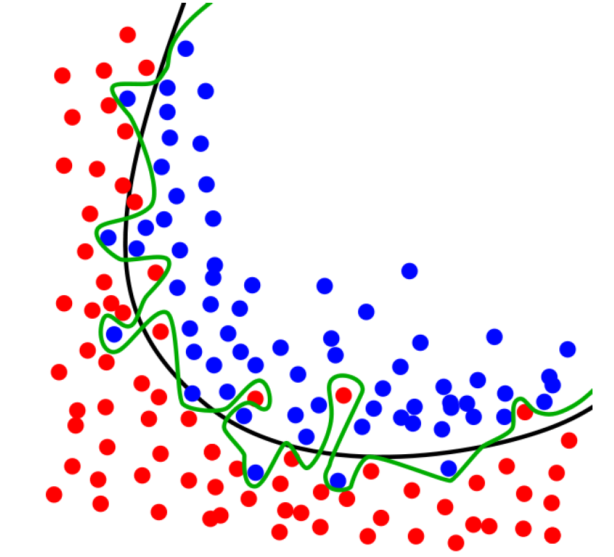
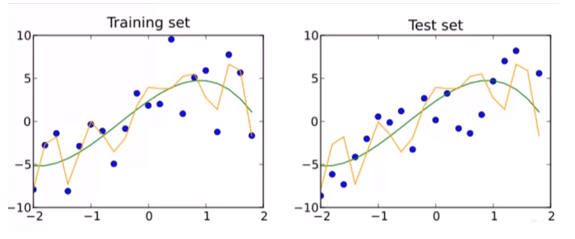
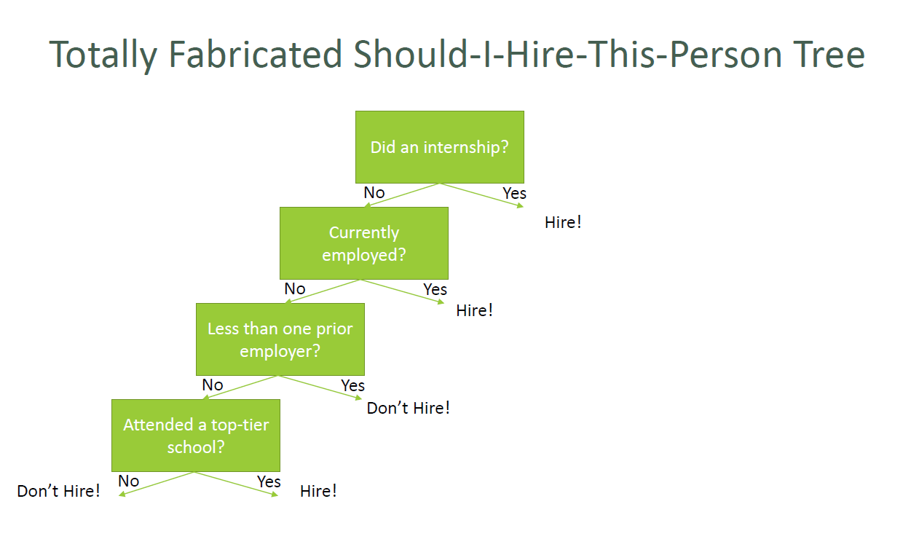
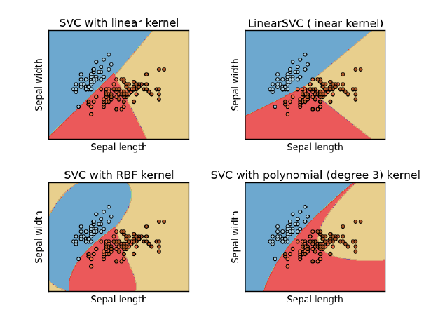

## Section 04: Machine Learning with Python

#### Table of Contents

- [Supervised vs. Unsupervised Learning, and Train/Test](#supervised-vs-unsupervised-learning-and-traintest)
- [Using Train/Test to Prevent Overfitting a Polynomial Regression](#using-traintest-to-prevent-overfitting-a-polynomial-regression)
- [Bayesian Methods: Concepts](#bayesian-methods-concepts)
- [Implementing a Spam Classifier with Naive Bayes](#implementing-a-spam-classifier-with-naive-bayes)
- [K-Means Clustering](#k-means-clustering)
- [Clustering people based on income and age](#clustering-people-based-on-income-and-age)
- [Measuring Entropy](#measuring-entropy)
- [WINDOWS: Installing Graphviz]()
- [MAC: Installing Graphviz](#mac)
- [LINUX: Installing Graphviz](#)
- [Decision Trees: Concepts](#decision-trees-concepts)
- [Decision Trees: Predicting Hiring Decisions](#decision-trees-predicting-hiring-decisions)
- [Ensemble Learning](#ensemble-learning)
- [XGBoost](#xgboost)
- [Support Vector Machines (SVM) Overview](#support-vector-machines)

### Supervised vs. Unsupervised Learning, and Train/Test

#### What is machine learning?

- Algorithms that can learn from observational data and can make predictions
  based on it

#### Unsupervised Learning

- The model is not given any "answers" to learn from
- It must make sense of the data just given the observations themselves
- Example: group (cluster) some objects together into 2 different sets. But I
  don't tell you want tht "right" set is for any object ahead of time.
  - Do I want big and small things? Round and square things? Red and blue
    things?
  - Unsupervised learning could give me any of those results

#### Unsupervised Learning

- Unsupervised learning sounds awful! Why use it?
- Maybe you don't know waht you're looking for -- you're looking for _latent
  variables_.
- Example: clustering users on a dating site based on their information and
  behavior. Perhaps you'll find there are groups of people that emerge that
  don't conform to your known stereotypes.
- Cluster movies based on their properties. Perhaps our current concepts of
  genre are outdated?
- Analyze the text of product descriptions to find the terms that carry the most
  meaning for a certain category.

#### Supervised Learning

- In supervised learning, the data the algorithm "learns" from comes with the
  "correct" answers.
- The model created is then used to predict the answer for new, unknown values.
- Example: You can _train_ a model for predicting car prices based on car
  attributes using historical sales data. That model can then predict the
  optimal price for new cars that haven't been sold before.

#### Evaluating Supervised Learning

- If you have a set of training data that includes the value you're trying to
  predict -- you don't have to guess if the resulting model is good or not.
- If you have enough training data, you can split it into two parts: a
  _training_ set and a _test_ set.
- You then train the model using only the training set
- And then measure (using r-squared or some other metric) the model's accuracy
  by asking it to predict values for the test set, and compare that to the
  known, true values.

#### Train / Test in practice

- Need to ensure both sets are large enough to contain representatives of all
  the variations and outliers in the data you care about
- The data sets must be selected randomly
- Train/test is a great way to guard against _overfitting_

#### Train/Test is not Infallible

- Maybe your sample sizes are too small
- Or due to random chance your train and test sets look remarkably similar
- Overfitting can still happen

#### K-fold Cross Validation

- One way to further protect against overfitting is K-fold cross validation
- Sounds complicated. But it’s a simple idea:
  - Split your data into K randomly-assigned segments
  - Reserve one segment as your test data
  - Train on each of the remaining K-1 segments and measure their performance
    against the test set
  - Take the average of the K-1 r-squared scores

### Using Train/Test to Prevent Overfitting a Polynomial Regression

Refer to [train_test.py](./code/train_test.py) for coding exercises.

### Bayesian Methods: Concepts

#### Remember Bayes' Theorem

- $P(A|B) = \frac{P(A)P(B|A)}{P(B)}$
- Let's use it for machine learning! I want a spam classifier.
- Example: how would we express the probability of an email being spam if it
  contains the word "free"?
- $P(Spam|Free) = \frac{P(Spam)P(Free|Spam)}{P(Free)}$
- The numerator is the probability of a message being spam and containing the
  word "free" (this is subtly different from what we're looking for)
- The denominator is the overall probability of an email containing the word
  "free". This is equivalent to
  $P(Free|Spam)P(Spam) + P(Free|Not Spam)P(Not Spam)$.
- So together, this ratio is the percentage of emails with the word "free" that
  are spam.

#### What about all other words?

- We can construct $P(Spam | Word)$ for every meaningful word we encounter
  during training
- Then multiply these together when analyzing a new email to get the probability
  of it is being spam.
- Assumes the presence of different words are independent of each other -- one
  reason this is called "Naive Bayes".

#### Sounds like a lot of work

- Scikit-learn to the rescue!
- The CountVectorizer lets us operate on lots of words at once, and
  MultinominalNB does all the heavy lifting on Naive Bayes.
- We'll train it on known sets of spam and "ham" (non-spam) emails
  - So this is supervised learning

### Implementing a Spam Classifier with Naive Bayes

Refer to [naive_bayes.py](./code/naive_bayes.py) for coding exercises.

### K-Means Clustering

#### K-Means Clustering

- Attempts to split data into K groups that are closest to K centroids
- Unsupervised learning -- uses only the positions of each data point
- Can uncover interesting groupings of people / things / behavior
  - Example: Where do millionaires live?
  - What genres of music / movie / book / etc. naturally fall out of data?
  - Create your own stereotypes from demographic data
- Sounds fancy! Wow! Unsupervised machine learning!
- Actually how it works is really simple.
  - Randomly pick K centroids (k-means)
  - Assign each data point to the centroid it is closest to
  - Recompute the centroids based on the average position of each centroid's
    points
  - Iterate until points stop changing assignment to centroid
- If you want to predict the cluster for new points, just find the centroid
  they're closest to.

#### K-Means Clustering Gotchas

- Choosing K
  - Try increasing K values until you stop getting large reductions in squared
    error (distances from each point to their centroids)
- Avoiding local minima
  - The random choice of initial centroids can yield different results
  - Run it a few times just to make sure your initial results aren't wacky
- Labeling the clusters
  - K-Means does not attempt to assign any meaning to the clusters you find
  - It's up to you to dig into the data and try to determine that meaning
- `scikit-learn` is awesome for this.

### Clustering people based on income and age

Refer to [k-means.py](./code/k-means.py) for coding exercises.

### Measuring Entropy

#### Entropy

- A measure of data set's disorder -- how same or different it is.
- If we classify data set into N different classes (example: a data set of
  animal attributes and their species)
  - The entropy is 0 if all of the classes in the data are the same (everyone is
    an iguana)
  - The entropy is high if they are all different

#### Computing Entropy

- $H(S) = -p_1 ln p_1 - ... - p_n ln p_n$
- $p_i$ represents the proportion of the data labeled for each class
- Each term looks like the image below

### Decision Trees: Concepts

#### Decision Trees

- You can actually construct a flowchart to help you decide a classification for
  something with machine learning
- This is called a **Decision Tree**
- Another form of supervised learning
  - Give it some sample data and the resulting classifications
  - Out comes a tree!

#### Decision Tree Example

- You want to build a system to filter out resumes based on historical hiring
  data
- You have a database of some important attributes of job candidates, and you
  know which ones were hired and which ones weren't
- You can train a decision tree on this data, and arrive at a system for
  predicting whether a candidate will get hired based on it!

#### Totally Fabricated Hiring Data

| **Candidate ID** | **Years of Exp** | **Employed** | **Ex Employers** | **Education Level** | **Top-tier school** | **Interned** | **Hired** |
| ---------------- | ---------------- | ------------ | ---------------- | ------------------- | ------------------- | ------------ | --------- |
| 0                | 10               | 1            | 4                | 0                   | 0                   | 0            | 1         |
| 1                | 0                | 0            | 0                | 0                   | 1                   | 1            | 1         |
| 2                | 7                | 0            | 6                | 0                   | 0                   | 0            | 0         |
| 3                | 2                | 1            | 1                | 1                   | 1                   | 0            | 1         |
| 4                | 20               | 0            | 2                | 2                   | 1                   | 0            | 0         |

#### How Decision Trees Work

- At each step, find the attribute we can use to partition the data set to
  minimize the _entropy_ of the data at the next step
- Fancy term for this simple algorithm: ID3
- It is a
  [greedy algorithm](https://github.com/lcycstudio/python/tree/master/courses/The%20Complete%20Data%20Structures%20and%20Algorithms%20Course%20in%20Python/43_greedy)
  -- as it goes down the tree, it just picks the decision that reduce entropy
  the most at that stage.
- That might not actually result in an optimal tree, but it works.
- `scikit-learn` is awesome for this.

#### Random Forests

- Decision trees are very susceptible to overfitting
- To fight this, we can construct several decision trees and let them "vote" on
  the final classification
  - Randomly re-sample the input data for each tree (fancy term for this:
    bootstrap aggregating or bagging)
  - Randomize a subset of the attributes each step is allowed to choose from

### Decision Trees: Predicting Hiring Decisions

Refer to [trees.py](./code/trees.py) for coding exercises.

### Ensemble Learning

#### Ensemble Learning

- Randome forests was an example of _ensemble learning_
- It just means we use multiple models to try and solve the same problem and let
  them vote on the results.
- Random Forests uses _bagging_ (bootstrap aggregating) to implement ensemble
  learning.
  - Many models are built by training on randomly-drawn subsets of the data
- _Boosting_ is an alternative technique where each subsequent model in the
  ensemble boosts attributes that address data mis-classified by the previous
  model
- A _bucket of models_ trains several different models using training data, and
  picks the one that works best with the test data
- _Stacking_ runs multiple models at once on the data, and combines the results
  together
  - This is how the Neflix prize was won!

#### Advanced Ensemble Learning: Ways to Sound Smart

- Bayes Optimal Classifier
  - Theoretically the best -- but almost always impractical
- Bayesian Parameter Averaging
  - Attemps to make BOC practical -- but it's still misunderstood, susceptible
    to overfitting, and often outperformed by the simpler bagging approach
- Bayesian Model Combination
  - Tries to address all of those problems
  - But in the end, it's about the same as using cross-validation to find the
    best combination of models

### XGBoost

#### XGBoost

- eXtreme Gradient Boosted trees
- Remember boosting is an ensemble method
  - Each tree boosts attributes that led to misclassifications of previous tree
- It is AMAZING
  - Routinely wins Kaggle competitions
  - Easy to use
  - Fast
  - A good choice for an algorithm to start with

#### Features of XGBoost

- Regularized boosting (prevents overfitting)
- Can handle missing values automatically
- Parallel processing
- Can cross-validate at each iteration
  - Enables early stopping, finding optimal number of iterations
- Incremental training
- Can plug in your own optimization objects
- Tree pruning
  - Generally results in deeper but optimized trees

#### Using XGBoost

- Pip install xgboost
- Also CLI, C++, R, Julia, JVM interfaces
- It's not just made for `scikit_learn`, so it has its own interface
  - Uses DMatrix structure to hold features & labels
    - Can create this easily from a numpy array though
  - All parameters passed in via a dictionary
- Can train, then predict. It's easy.

#### XGBoost Hyperparameters

- Booster
  - gbtree or gblinear
- Objective (i.e., multi: softmax, multi: softprob)
- Eta (learning rate - adjusts weights on each step)
- Max_depth (depth of the tree)
- Min_child_weight
  - Can control overfitting, but too high will undefit
- And many others

#### XGBoost

- It's almost all that you need to know for ML in practical terms, at least for
  simple classification or regression problems.

Refer to [xg_boost.py](./code/xg_boost.py) for coding exercises.

### Support Vector Machines (SVM) Overview

#### Support Vector Machines

- Works well for classifying higher-dimensional data (lots of features)
- Finds higher-dimensional _support vectors_ across which to divide the data.
  Mathematically, these support vectors define hyperplanes.
- Uses something called the _kernel trick_ to represent data in
  higher-dimensional spaces to find hyperplanes that might not be apparent in
  lower dimensions.

#### Higher dimensions? Hyperplanes?

- The important point is that SVM's employ some advanced mathematical trickery
  to cluster data, and it can handle data sets with lots of features.
- It's also fairly expensive -- the "kernel trick" is the only thing that makes
  it possible.

#### Support Vector Classification

- In practice you'll use something called SVC to classify data using SVM.
- You can use different "kernels" with SVC. Some will work better than others
  for a given data set.

