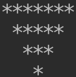

## Section 03: Strings Part 1

#### Table of Contents

- strings
- Strings Exercises
- Strings Exercises Solution
- type() and str()
- Escape Sequences
- type(), str(), and escape sequences exercises
- type(), str(), and escape sequences exercises solution
- Programming Challenge: Asterisk Triangle
- Asterisk Triangle Solution
- input()
- Programming Challenge: Monty Python
- Monty Python Solution
- int() and float()
- int() exercise
- int() exercise solution(s)

### strings

```python
ex_1 = 'This is a string'
ex_2 = 'This is also a string'
ex_3 = '1984!'
ex_4 = "LiVe LONG and PRosPEr."
ex_5 = "!@#$%^&*(_+)"
ex_6 = ""
ex_7 = "0123456"
```

#### Indexing

In plain English, indexing is the position of an item inside a large object. For
example, the index of 1 inside 12345 is 1. In contrast to English indexing, the
first index of anything is 0 in Python or most of other programming languages.
For example, the index of "o" in the string "orange" is 0.

```python
ex_8 = "orange"
print(ex_8[0])
# o

print("apple"[4])
# e
```

#### Slice Indexing

It is just cutting a string into a smaller piece.

```python
ex_10 = "apricots"
print(ex_10[:3])
print(ex_10[2:5])
print(ex_10[4:])
```

#### Concatenation

It is the action of linking things together in a series.

```python
print("pecan" + " " + "pie")

concatenated = "R2" + " " + "D2"
print(concatenated)
print(concatenated[3])
print(concatenated[1:4])
```

#### Accessing by index and string slicing on variables

```python
unchanged = "forrest gump"
sliced = unchanged[6:]
print(sliced)
print(unchanged)
print(unchanged[10])
```

### Strings Exercises

Do all of this in a .py file in Pycharm

- Create a variable and assign it the string "Just do it!"
- Access the "!" from the variable by index and `print()` it
- Print the slice "do" from the variable
- Get and print the slice "it!" from the variable
- Print the slice "Just" from the variable
- Get the string slice "do it!" from the variable and concatenate it with the
  string "Don't ". Print the resulting string, which should be "Don't do it!"
  where the "do it!" part is a slice.

```python
a = "Just do it!"
print(a[10])
print(a[5:7])
print(a[8:])
print(a[0:4])
print("Don't " + a[5:])
```

### Strings Exercises Solution

```python
to_slice = "Just do it!"
print(to_slice[10])   # prints "!"
print(to_slice[5:7])  # prints "do"
print(to_slice[8:])   # prints "it!"
print(to_slice[:4])   # prints "Just"
print("Don't " + to_slice[5:])  # prints "Don't do it!"
```

### type() and str()

`type()` will return the data type of a value or variable.

```python
ex_1 = False
ex_2 = 29
ex_3 = 4.1352
print(type(ex_1))
print(type(ex_2))
print(type(ex_3))
```

`str()` converts a value of another type into string.

```python
ex_4 = str(False)
ex_5 = str(5)
ex_6 = str(3.21)
print(type(ex_4))
print(type(ex_5))
print(type(ex_6))
print(ex_4)
print(ex_5)
print(ex_6)
```

### Escape Sequences

To insert characters that are illegal in a string, use an escape character. An
escape character is a backslash \ followed by the character you want to insert.

| Sequence  |    Symbol    |
| :-------: | :----------: |
|    Tab    |     `\t`     |
| New line  |     `\n`     |
|  Quotes   | `\'` or `\"` |
| Backslash |     `\\`     |

```python
# Tab
print("This\tis\ta\tlot\tof\tspace.")
# New line
print("line one\nline two")
# Quotes
print('"When I said \'immediately,\' I meant today!" said King Saul.')
print("\"Do or do not. There is no try.\"")
# Backslash
print("I want to have a blackslash here \\")
```

### type(), str(), and escape sequences exercises

Do all of this in a .py file in Pycharm.

- Create a variable and assign it a float
- Use `print()` and `type()` to print the data type of the variable in the
  output
- Use `str()` on the variable from step 1 and concatenate it with the string "
  is a float." then use `print()` to display the result
- `print()` the string "Hello, I'm [name], it's nice to meet you!" including
  quotes (you will need to use the \' or \" escape sequence depending on whether
  you enclose your strings in single quotes or double quotes.)

```python
a = 1.2
print(a)
print(type(a))
print(str(a) + " is a float.")
print("Hello, I'm Jackie, it\'s nice to meet you!" )
print("Hello, I am Jackie, and I say \"Nice to meet you!\"" )
print('Hello, I\'m Jackie, it\'s nice to meet you!' )
print('Hello, I am Jackie, and I say "Nice to meet you!"' )
```

### type(), str(), and escape sequences exercises solution

```python
float_num = 6.7                                     # variable that has been assigned a float
print(type(float_num))                              # prints the type of float_num
print(str(float_num) + " is a float.")              # prints "6.7 is a float."
print("\"Hello, I'm Aaron, it's nice to meet you!\"")  # prints "Hello, I'm Aaron, it's nice to meet you!"
```

### Programming Challenge: Asterisk Triangle

Using your knowledge of escape sequences, create a single print() statement with
single string inside of it that displays this when the program is run:



```python
print('*******\n *****\n  ***\n   *')
```

### Asterisk Triangle Solution

```python
print("*******\n *****\n  ***\n   *")
```

### input()

```python
name = input("Please enter your name.")
print("Your name is " + name + ".")
print(type(name))
```

```python
fav_num = input("What is your favourite number?")
print("Your favourite number is " + fav_num + ".")
print(type(fav_num))
```

### Programming Challenge: Monty Python

In a .py file, create a program and use input() three times to get answers to
the following questions from a user. Store each of the answers in a variable.

- What is your name?
- What is your quest?
- What is your favorite color?
- Then, concatenate everything into a string within a print() statement with the
  form "So your name is [name], your quest is [quest], and your favorite color
  is [color]."

```python
name = input("What is your name?")
quest = input("What is your quest?")
color = input("What is your favourite color?")
print("So your name is " + name + ", your quest is " + quest + ", and your favourite color is " + color + ".")
```

### Monty Python Solution

```python
name = input("What is your name?")
quest = input("What is your quest?")
color = input("What is your favorite color?")

print("So your name is " + name + ", your quest is " + quest + ", and your favorite color is " + color + ".")
```

### int() and float()

Int `int()`

```python
user_int = int(input("Please enter an integer."))
print(user_int)
print(type(user_int))
```

|          What `int()` is being used on          |            Example            |         Outcome          |
| :---------------------------------------------: | :---------------------------: | :----------------------: |
| string of letters, numbers, symbols, and spaces | `int("numb3rs 4nd $ymbols!")` |          Error           |
|                string is a float                |         `int("1.59")`         |          Error           |
|                      float                      |          `int(11.9)`          | Nearest integer <= float |
|          string that is an expression           |       `int("10.1+9.3")`       |          Error           |
|                   expression                    |       `int(10.1 + 9.3)`       | Nearest integer <= float |

Float `float()`

```python
user_float = float(input("Please enter a float."))
print(user_float)
print(type(user_float))
```

|         What `float()` is being used on         |             Example             | Outcome |
| :---------------------------------------------: | :-----------------------------: | :-----: |
| string of letters, numbers, symbols, and spaces | `float("numb3rs 4nd $ymbols!")` |  Error  |
|               string is a integer               |          `float("1")`           |  float  |
|                     integer                     |          `float(11.9)`          |  float  |
|          string that is an expression           |         `float("10+9")`         |  Error  |
|                   expression                    |          `float(10+9)`          |  float  |

### int() exercise

In a Python file, use input() to ask the user to enter an integer. Assign what
they type to a variable. Then add 10 to this integer. print() the sum of the
integer they entered and 10.

```python
abc = int(input("Enter an integer"))
print(abc + 10)
```

### int() exercise solution(s)

Solution 1:

```python
use_int = int(input("Please enter an integer."))
print(use_int + 10)
```

Solution 2:

```python
use_int = input("Please enter an integer.")
print(int(use_int) + 10)
```
