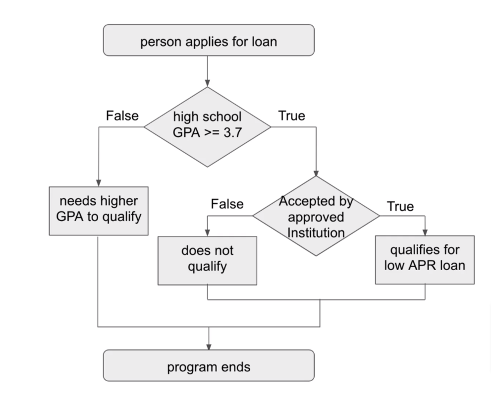

## Section 05: Flow Control

#### Table of Contents

- Intro to Flow Control
- Quiz 4: comparison operators quiz
- Quiz 5: boolean operators quiz
- if statements
- else statements
- nested if and else statements
- Programming Challenge: Grade Determiner
- Grade Determiner Solution
- elif statements
- Programming Challenge: Roman Numeral Equivalent
- Roman Numeral Equivalent Solution
- truthy and falsey values

### Intro to Flow Control

#### Comparison Operators

- `>`: greater than
- `<`: less than
- `>=`: greater than or equal to
- `<=`: less than or equal to
- `!=`: not equal to
- `==`: equal to

#### Number Comparison

```python
print(4 > 2) # True
print(1 > 3) # False
print(9 >= 9) # True
print(4 <= 6) # True
print(10 != 100) # True
print(10 == 100) # False
print(10 == 10) # True
```

#### String Comparison

```python
print("hello" == "hello") # True
print("hello" != "world") # True
print("hello" == "Hello") # False (H is different)
print("hello" == "world") # False
```

#### Boolean Operators

- `and`
- `or`
- `not`

#### and

|        -        |   -    |
| :-------------: | :----: |
|    Statement    | Result |
|  True and True  |  True  |
| True and False  | False  |
| False and True  | False  |
| False and False | False  |

```python
print(4 > 1 and 2 > 1) # True and True --> True
print(8.76 == 8.7600 and 2 != 2) # True and False --> False
print("earth" == "Earth" and 6 > 3) # False and True --> False
print(10 == 5 and 5 != 5) # False and False --> False
```

#### or

|       -        |   -    |
| :------------: | :----: |
|   Statement    | Result |
|  True or True  |  True  |
| True or False  |  True  |
| False or True  |  True  |
| False or False | False  |

```python
print(4 > 1 or 2 > 1) # True or True --> True
print(8.76 == 8.7600 or 2 != 2) # True or False --> True
print("earth" == "Earth" or 6 > 3) # False or True --> True
print(10 == 5 or 5 != 5) # False or False --> False
```

#### not

|     -     |   -    |
| :-------: | :----: |
| Statement | Result |
| not True  | False  |
| not False |  True  |

```python
print(not 682 > 0) # not True --> False
print(not "Python" != "Python") # not False --> True
```

### Quiz 4: comparison operators quiz

#### Question 1:

What is the operator that is used to check if two things are identical?

`==`

#### Question 2:

What comparison operator is used to check if something is not equal to something
else?

The is not equal to comparison operator is represented by `!=`.

#### Question 3:

What are the two comparison operators that are used to represent less than and
greater than?

Less than is represented by `<` and greater than is represented by `>`.

#### Question 4:

What are the two comparison operators that are used to represent less than or
equal to and greater than or equal to?

The less than or equal to comparison operator is represented by `<=` and the
greater than or equal to comparison operator is represented by `>=`.

### Quiz 5: boolean operators quiz

#### Question 1:

What does

True and False evaluate to? `False`

#### Question 2:

What does

`print("PIZZA" == "pizza" or 100 == 100.00)` evaluate to?

#### Question 3:

What comparison operators out of the 3 options available should be used in place
of the question marks for this

`not True ? False and "green" ? "red"`

to evaluate to True?

`== and !=` not True evaluates to False and "green" and "red" are not equivalent
strings

### if statements

```python
if True:
    "Do the stuff here"
```

```python
veg = input("Type the name of the vegetable.")

if veg == "corn":
    print("The vegetable is corn.")
```

### else statements

```python
if True:
    "Do the stuff here"
else:
    "Do the other stuff here"
```

```python
veg = input("Type the name of the vegetable.")

if veg == "corn":
    print("The vegetable is corn.")
else:
    print("The vegetable is not corn.")
```

### nested if and else statements

<div>

</div>

```python
gpa = float(input("What was the applicant's grade point average?"))
inst_app = input("Is the student going to be educated at an approved institution?")

if gpa >= 3.7:
    if inst_app == "yes":
        print("The applicant qualifies for a low APR student loan.")
    else:
        print("The applicant does not qualify since they have not been accepted into an approved institution.")
else:
    print("The applicant did not have high enough grades to qualify.")
```

### Programming Challenge: Grade Determiner

Professor Fuentes teaches a Python class and uses the following grading scale
for all of her exams. You work as a teacher's assistant and due to her busy
schedule she has requested that you write a program which will determine the
grades of the class's students.

Her grading scale is as follows:

- A score of 90 or above is an A
- A score of 80 or above is a B
- A score of 70 or above is a C
- A score of 60 or above is a D
- A score any lower is an F

For this exercise, start by creating a variable and assigning that variable a
student's score as an integer using input().

Then, using nested if and else statements and the following set of rules,
determine and then display the student's grade along with their score using
print().

- If the student's score is greater than or equal to 90, then the student will
  receive an A grade.
- Otherwise, if the student's score is greater than or equal to 80, then the
  student will receive an B grade.
- Otherwise, if the student's score is greater than or equal to 70, then the
  student will receive an C grade.
- Otherwise, if the student's score is greater than or equal to 60, then the
  student will receive an D grade.
- Otherwise, the student will receive an F grade.

Make sure to run your program multiple times and test it with values for each 5
of the different grades to make sure that the correct output is displayed for
any value entered as a student's score.

[grading_if_else.py](./grading_if_else.py)

### Grade Determiner Solution

```python
score = int(input("Please enter the student's score. "))

if score >= 90:
    print("This student's score of " + str(score) + " is an A.")
else:
    if score >= 80:
        print("This student's score of " + str(score) + " is a B.")
    else:
        if score >= 70:
            print("This student's score of " + str(score) + " is a C.")
        else:
            if score >= 60:
                print("This student's score of " + str(score) + " is a D.")
            else:
                print("This student's score of " + str(score) + " is a F.")
```

### elif statements

```python
user_num = int(input("Please enter an integer."))
if user_num < 0:
    print("The number you entered is less than 0.")
elif user_num == 0:
    print("The number you entered is 0.")
elif 0 < user_num <= 100:
    print("The number you entered can be 1, 100, or anything in between.")
else:
    print("The number you entered is greater than 100.")
```

### Programming Challenge: Roman Numeral Equivalent

For this exercise, start by creating a variable and assigning it a randomly
generated integer between and inclusive of both 1 and 10.

Then, using your knowledge of if, elif, and else statements, create a program
which prints the roman numeral equivalent of the randomly generated number.

For example, if the randomly generated integer was 9, then the program would say
that the roman numeral equivalent of 9 is IX in the output.

[roman.py](./roman.py)

### Roman Numeral Equivalent Solution

```python
from random import randint
one_to_ten = randint(1, 10)

if one_to_ten == 1:
    print("The roman numeral equivalent of " + str(one_to_ten) + " is I.")
elif one_to_ten == 2:
    print("The roman numeral equivalent of " + str(one_to_ten) + " is II.")
elif one_to_ten == 3:
    print("The roman numeral equivalent of " + str(one_to_ten) + " is III.")
elif one_to_ten == 4:
    print("The roman numeral equivalent of " + str(one_to_ten) + " is IV.")
elif one_to_ten == 5:
    print("The roman numeral equivalent of " + str(one_to_ten) + " is V.")
elif one_to_ten == 6:
    print("The roman numeral equivalent of " + str(one_to_ten) + " is VI.")
elif one_to_ten == 7:
    print("The roman numeral equivalent of " + str(one_to_ten) + " is VII.")
elif one_to_ten == 8:
    print("The roman numeral equivalent of " + str(one_to_ten) + " is VIII.")
elif one_to_ten == 9:
    print("The roman numeral equivalent of " + str(one_to_ten) + " is IX.")
else:
    print("The roman numeral equivalent of " + str(one_to_ten) + " is X.")
```

### truthy and falsey values

```python
print(bool(0)) # False
print(bool(400)) # True
print(bool(0.0)) # False
print(bool(3.14159)) # True
print(bool("")) # False
print(bool("hello world")) # True
```
